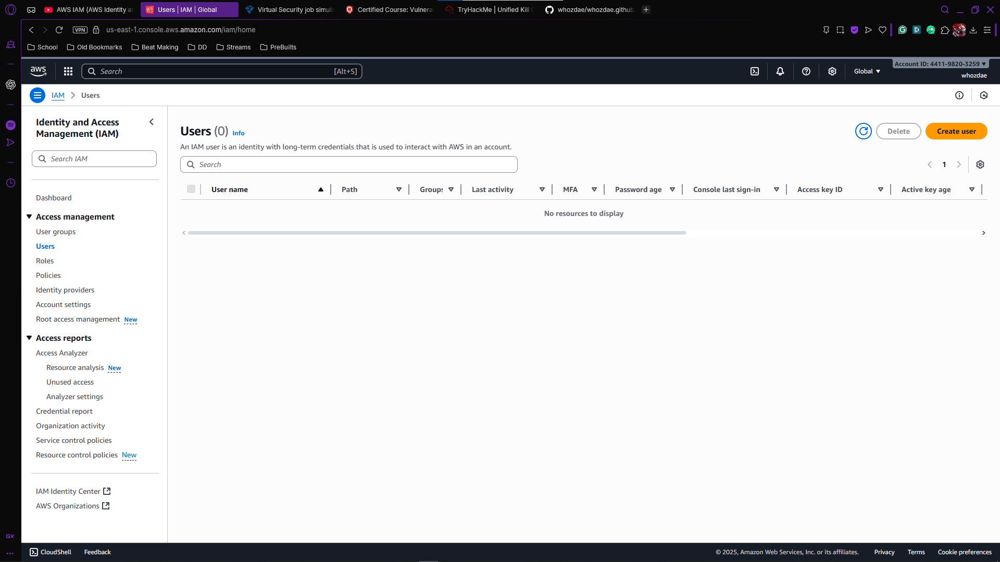

# AWS IAM Lab

## Objective

A hands-on lab focused on mastering Identity and Access Management (IAM) in AWS. The project covers creating users, groups, and roles, managing permissions with policies, and implementing least-privilege access. Demonstrates practical skills in securing AWS resources, auditing access, and documenting configurations for real-world cloud security scenarios.

### Skills Learned

- Designing and managing AWS IAM users, groups, and roles.
- Implementing least-privilege access and permission boundaries.
- Creating and managing IAM policies for secure access control.
- Auditing and monitoring AWS account activity for security compliance.
- Understanding practical cloud security best practices and risk mitigation.

### Tools Used

- AWS Management Console for creating and managing IAM users, groups, and roles.
- AWS CLI for automating IAM tasks and policy management.
- AWS CloudTrail for auditing and monitoring account activity.
- JSON editor or IDE for writing and testing IAM policies.
- AWS IAM Policy Simulator for validating permissions and access controls.

## Steps
When I started the AWS IAM lab, the first thing I did was log in to AWS and navigate to the IAM dashboard. I wanted to get a feel for the structure and see how everything was organized before diving in.

From there, I explored the Users section. I opened each user account, inspecting their permissions and group memberships to understand how access was granted. This helped me see the connection between individual users and the broader organizational access strategy.

Next, I moved on to Groups. I looked at each group’s membership and attached policies, noticing how AWS-managed policies differ from custom ones. It was interesting to see how group-level permissions simplify access management and enforce consistency across users.
  

Then, I took a deep dive into Policies. I compared AWS-managed policies with custom JSON policies, analyzing how permissions are defined and how granular control can be applied. To make sure my understanding was solid, I used the IAM Policy Simulator to test access scenarios. I even tweaked some policies and ran simulations again to see the impact of my changes firsthand.
  

  

  

Throughout the lab, I documented my findings carefully—screenshots, notes, and reflections—which reinforced my understanding and gave me a reference for future work. To take it one step further, I created content to teach the process, which helped me solidify my mastery of IAM concepts while also practicing how to communicate technical knowledge clearly.

By the end, I wasn’t just following instructions; I had a hands-on grasp of how AWS IAM structures access, the nuances of policy management, and the practical steps needed to maintain secure, least-privilege access in a real-world environment.
